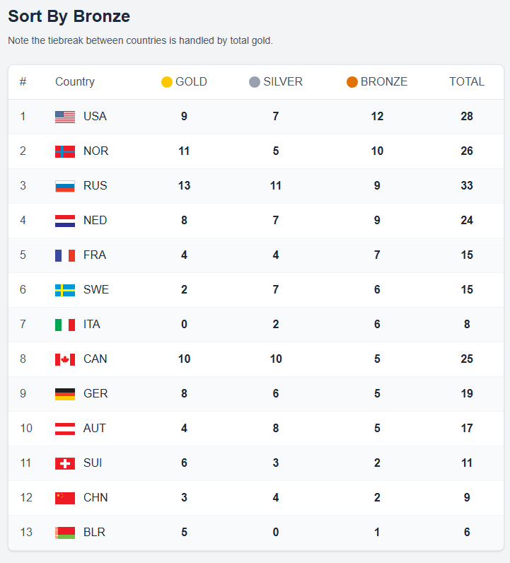

# Medal Rankings App

A dynamic Next.js application that displays Olympic medal rankings with interactive sorting capabilities. Users can sort countries by gold, silver, bronze, or total medals with proper tiebreaker logic.



## 🏆 Features

- **Interactive Sorting**: Click column headers to sort by gold, silver, bronze, or total medals
- **URL-based State**: Sort preferences persist in URL parameters (`?sort=gold|silver|bronze|total`)
- **Tiebreaker Logic**:
  - Total medals sort: ties broken by most gold
  - Gold medals sort: ties broken by most silver
  - Silver medals sort: ties broken by most gold
  - Bronze medals sort: ties broken by most gold
- **Flag Display**: Country flags rendered using CSS sprites
- **Error Handling**: Graceful fallback with retry functionality when API fails
- **Responsive Design**: Mobile-friendly table layout
- **Real-time Updates**: No page refresh needed when changing sort order

## 🛠 Technical Stack

- **Framework**: Next.js 15.3.3 with App Router
- **Language**: TypeScript
- **Styling**: Tailwind CSS
- **Testing**: Jest + React Testing Library
- **Build Tools**:
  - Turbopack (development)
  - Webpack (production)
- **Code Quality**: ESLint

## 📁 Project Structure

```
medal-rankings-app/
├── src/
│   ├── app/
│   │   ├── api/medals/route.ts          # Medal data API endpoint
│   │   ├── layout.tsx                   # Root layout
│   │   ├── page.tsx                     # Main page component
│   │   └── globals.css                  # Global styles
│   ├── components/
│   │   ├── __tests__/
│   │   │   └── Flag.test.tsx           # Flag component tests
│   │   ├── Flag.tsx                    # Flag sprite component
│   │   └── MedalRankings.tsx           # Main rankings table
│   ├── data/
│   │   └── medals.json                 # Medal data
│   ├── types/
│   │   └── medal.ts                    # TypeScript interfaces
│   └── utils/
│       ├── __tests__/
│       │   └── medalSorting.test.ts    # Sorting logic tests
│       └── medalSorting.ts             # Sorting utilities
├── public/
│   └── flags.png                       # Flag sprite sheet
├── .env.local                          # Development environment
├── .env.production                     # Production environment
├── jest.config.js                      # Jest configuration
├── jest.setup.js                       # Jest setup
└── package.json                        # Dependencies and scripts
```

## 🚀 Getting Started

### Prerequisites

- Node.js 18+
- npm or yarn

### Installation

1. **Clone the repository**

```bash
git clone <repository-url>
cd medal-rankings-app
```

2. **Install dependencies**

```bash
npm install
```

3. **Set up environment variables**

```bash
# .env.local already exists with:
NEXT_PUBLIC_API_BASE_URL=http://localhost:3000
```

4. **Add medal data**
   - Place your `medals.json` file in `src/data/`
   - Place your `flags.png` sprite sheet in `public/`

### Development

```bash
# Start development server with Turbopack
npm run dev

# Open browser to http://localhost:3000
```

### Production Build

```bash
# Build for production (uses Webpack)
npm run build

# Start production server
npm start
```

## 🧪 Testing

### Run Tests

```bash
# Run all tests
npm test

# Run tests in watch mode
npm run test:watch

# Run tests with coverage
npm test -- --coverage
```

### Test Coverage

- **Flag Component**: Sprite positioning, styling, accessibility
- **Medal Sorting**: All sort types, tiebreaker logic, edge cases
- **Type Safety**: TypeScript interfaces and type checking

### Manual Testing

1. **Default Behaviour**: Visit `/` - should sort by gold medals
2. **URL Parameters**:
   - `/` → sorts by gold (default)
   - `/?sort=silver` → sorts by silver medals
   - `/?sort=bronze` → sorts by bronze medals
   - `/?sort=total` → sorts by total medals
3. **Interactive Sorting**: Click column headers to change sort
4. **Error Handling**: Uncomment error simulation in `src/app/api/medals/route.ts`

## ⚙️ Configuration

### Environment Variables

| Variable                   | Development             | Production                | Description            |
| -------------------------- | ----------------------- | ------------------------- | ---------------------- |
| `NEXT_PUBLIC_API_BASE_URL` | `http://localhost:3000` | `https://your-domain.com` | Base URL for API calls |

### Flag Sprite Configuration

The flag sprite sheet (`public/flags.png`) should contain flags arranged vertically:

- **Dimensions**: 28px width × 17px height per flag
- **Format**: PNG with transparent background

### Medal Data Format

```json
[
  {
    "code": "USA",
    "gold": 9,
    "silver": 7,
    "bronze": 12
  }
]
```

## 📈 Performance

- **Development**: Turbopack for fast builds and hot reload
- **Production**: Webpack with optimisations
- **Bundle Size**: Optimised with code splitting and tree shaking
- **API**: Simulated delay of 100ms for realistic UX

## 🚀 Deployment

### Build Commands

```bash
# Development build
npm run dev

# Production build
npm run build
npm start
```

### Environment Setup

1. Update `NEXT_PUBLIC_API_BASE_URL` in production environment
2. Ensure all environment variables are configured
3. Test production build locally before deployment
